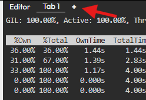
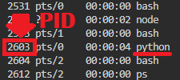

## Top command
We'll start with the `top`{{}} command, which provides a top-like view of the CPU usage of function calls. This is an effective way to investigate which calls are resource-intensive. To use this command, we can either choose to start a program or attach py-spy to an already running program.

```
py-spy top -- python executable.py
# OR
py-spy top --pid <PID>
```

## Using Top and Starting a Program

We will first start and monitor `exampleprogram.py`{{}}, which is located in our working directory. To accomplish this, we'll run the following command.

`py-spy top -- python exampleprogram.py 35`{{exec}}

This shows us clearly which functions are called and how much time they take to execute.


## Using Top and Attaching to a Running Program

The first command works great for troubleshooting slow programs but isn't viable for usage in production. We will now go over how to attach the profiler to an already running process. Py-spy requires little computing power and runs as a separate process, making it safe to use in production.

The first step is to press the little `+`{{}} to the right of `Tab 1`{{}} to open a new terminal window. 



Enter that window and run your Python program.

`python exampleprogram.py 40`{{exec}}

Now we can go back to the original tab and run the following command.

`ps -e`{{exec interrupt}} 

This lists all our running processes, and we'll look for the one named `python`{{}}. It should be near the bottom, as we just started it. Take note of the number to the left, this is the PID.



After finding the pid, we will now run.

`py-spy top --pid <PID>` 

Make sure to replace `<PID>`{{}} with the PID you found, e.g with the PID `2603`{{}} the command would be `py-spy top --pid 2603`{{}}.

The command might fail if you're too slow, as the program only runs for about a minute. If that is the case, you'll need to go back to the other terminal tab and start the program again as you did earlier.

Now that it's attached, we can once again see what functions are being called and where the CPU is spending time.