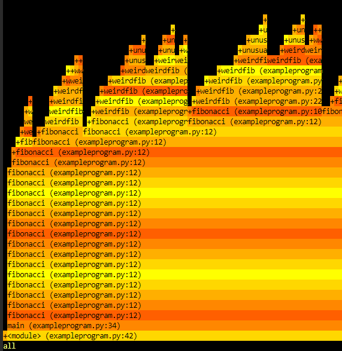

## Record command
The `record`{{}} command can be called in one of two ways, like `Top`{{}}.
```
py-spy record -o output.svg --pid <PID>
# OR
py-spy record -o output.svg -- python executable.py
```
We can also use the `-f`{{}} flag to change the output format. By default it generates a SVG flamegraph, but you can also specify `raw`{{}} or `speedscope`{{}}. We will be using the `-f raw`{{}} because Killercoda does not have any sort of display. `speedscope`{{}} is used to generate files in JSON which can be used by the Speedscope profiler, which we will not be diving into today.

Also of importance is that the flag `-o`{{}} does not need to be used, but py-spy autogenerates the filename without it so we use it for comfort.

## Prereqs
Because there is no display here, we will be using a terminal viewer for seeing the flamegraphs. Start by running this.

`git clone https://github.com/4rtzel/tfg`{{exec}}

We have now gotten the terminal flame graph viewer (tfg), which is also written in Python. There are other alternatives but this is the one that we will be using, if you are interested in reading about it you can do so here `https://github.com/4rtzel/tfg`.

## Using Record

We will start by running record on our program `exampleprogram.py`{{}} and since we will be using `tfg`{{}} to view it we will make sure to use `-f raw`{{}}.

`py-spy record -o output.txt -f raw -- python exampleprogram.py 38`{{exec}}

This will take approximately 20 seconds, but after Py-Spy informs you that its done, we can open the flamegraph via.

`tfg/tfg.py -t pyspy output.txt`{{exec}}

The flamegraph should look like this. It is a visualization of hierarchical data, created to visualize stack traces of profiled software so that the most frequent code-paths can be identified quickly and accurately.



We can also move around with the arrowkeys to see what is being called and by what.
When we feel satisfied we can exit by pressing `q`{{}}.

If you want to read up more on flamegraphs we recommend using the following resource `https://www.brendangregg.com/flamegraphs.html`.