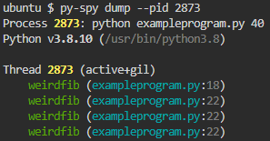

## Dump command
The `dump`{{}} command can be called like this.
```
py-spy dump --pid <PID>
```

## Using dump
We will use `exampleprogram.py`{{}}. We will need to find the PID, just like when we attached `top`{{}} to a running process. Go to a second terminal tab and run.

`python exampleprogram.py 40`{{exec}}

Now we'll go back to the first tab and run.

`ps -e`{{exec}} 

Take note of the Python process PID which should be near the bottom.

We can now run `dump`{{}} to find the Python call stack. And remember to change `<PID>`{{}} to the correct number that you see in the terminal for example it should look something like this `py-spy dump --pid 2470`{{}}.

`py-spy dump --pid <PID>`

Now we should see something that looks like this.



This explains what process has been dumped, meaning you will see which threads it has and what functions these threads are calling. This can be very useful if you're executing over multiple threads. It also tells us that the process we dumped has a thread which is (active+gil) which means it is the active thread (because we're only running 1 thread) and that it has the gil (Global Interpreter Lock).